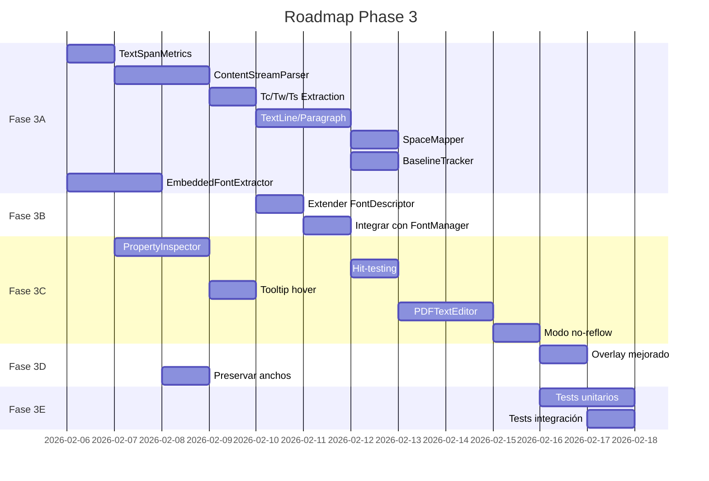

# PHASE 3 - PDF TEXT ENGINE

## Plan de Objetivos y Requisitos de Mejora (PORM)

**Fecha**: 5 de febrero de 2026  
**Versión**: 1.5  
**Estado**: 🔄 EN PROGRESO  
**Última actualización**: 6 de febrero de 2026

---

## 📊 PROGRESO DE IMPLEMENTACIÓN

### Resumen General

| Fase | Descripción | Estado | Tests |
| ---- | ----------- | ------ | ----- |
| **Fase 3A** | Motor de Extracción | ✅ COMPLETADO | 420 |
| **Fase 3B** | Integración FontManager | ✅ COMPLETADO | 119 |
| **Fase 3C** | UI de Edición | 🔄 EN PROGRESO | 248 |
| **Fase 3D** | Reescritura Segura | ⏳ Pendiente | - |
| **Fase 3E** | Tests y Validación | 🔄 Incluido en cada fase | - |

**Total tests del proyecto: 1115 pasando** ✅

---

### Detalle Fase 3A: Motor de Extracción ✅ COMPLETADO

| Tarea | Descripción | Estado | Tests |
| ----- | ----------- | ------ | ----- |
| **3A-01** | TextSpanMetrics dataclass | ✅ COMPLETADO | 60 |
| **3A-02** | ContentStreamParser completo | ✅ COMPLETADO | 87 |
| **3A-03** | Extraer Tc/Tw | ✅ INCLUIDO EN 3A-02 | - |
| **3A-04** | Extraer Ts (rise) | ✅ INCLUIDO EN 3A-02 | - |
| **3A-05** | Matrices de transformación | ✅ COMPLETADO | 55 |
| **3A-06** | TextLine con agrupación | ✅ COMPLETADO | 74 |
| **3A-07** | TextParagraph con detección | ✅ COMPLETADO | 53 |
| **3A-08** | SpaceMapper | ✅ COMPLETADO | 52 |
| **3A-09** | BaselineTracker | ✅ COMPLETADO | 39 |
| **3A-10** | EmbeddedFontExtractor | ✅ INCLUIDO EN 3B | - |

---

### Detalle Fase 3B: Integración FontManager ✅ COMPLETADO

| Tarea | Descripción | Estado | Tests |
| ----- | ----------- | ------ | ----- |
| **3B-01** | Extender FontDescriptor | ✅ COMPLETADO | 25 |
| **3B-02** | detect_embedded_status() | ✅ COMPLETADO | 18 |
| **3B-03** | get_precise_metrics() | ✅ COMPLETADO | 28 |
| **3B-04** | Mejorar detect_possible_bold() | ✅ COMPLETADO | 22 |
| **3B-05** | Integrar con EmbeddedFontExtractor | ✅ COMPLETADO | 26 |

---

### Detalle Fase 3C: UI de Edición 🔄 EN PROGRESO

| Tarea | Descripción | Estado | Tests |
| ----- | ----------- | ------ | ----- |
| **3C-01** | PropertyInspector widget | ✅ COMPLETADO | 53 |
| **3C-02** | Hit-testing preciso en PDFPageView | ✅ COMPLETADO | 49 |
| **3C-03** | Tooltip de propiedades al hover | ✅ COMPLETADO | 52 |
| **3C-04** | Selección con visualización de métricas | ✅ COMPLETADO | 94 |
| **3C-05** | PDFTextEditor integrado | ✅ COMPLETADO | 73 |
| **3C-06** | Modo "no reflow" con cajas fijas | ⏳ SIGUIENTE | - |
| **3C-07** | Validación "cabe/no cabe" | ⏳ Pendiente | - |
| **3C-08** | Opciones de ajuste | ⏳ Pendiente | - |

---

## ✅ Tareas Completadas (Detalle)

### ✅ 3A-01: TextSpanMetrics (COMPLETADO)

**Archivos creados:**

- `core/text_engine/__init__.py` - Módulo principal v0.6.0
- `core/text_engine/text_span.py` - TextSpanMetrics (~600 líneas)
- `tests/test_text_span.py` - 60 tests

**Características implementadas:**

- ✅ `TextSpanMetrics` dataclass con 40+ campos
- ✅ `RenderMode` enum (8 modos de render PDF)
- ✅ `FontEmbeddingStatus` enum (4 estados)
- ✅ Detección automática de subset por nombre (ABCDEF+Font)
- ✅ Detección de super/subscript por rise
- ✅ Propiedades calculadas: width, height, center, style_summary
- ✅ Comparación de estilos: has_same_style(), has_same_spacing(), is_on_same_baseline()
- ✅ Serialización JSON completa: to_dict(), from_dict(), to_json(), from_json()
- ✅ Factory function: create_span_from_pymupdf()
- ✅ Método detailed_info() para tooltips/debugging

**Tests:** 60/60 pasando (100%)

### ✅ 3A-02: ContentStreamParser (COMPLETADO)

**Archivos creados:**

- `core/text_engine/content_stream_parser.py` - Parser completo (~850 líneas)
- `tests/test_content_stream_parser.py` - 87 tests

**Características implementadas:**

- ✅ `TextOperator` enum con todos los operadores de texto PDF
- ✅ `TextState` dataclass para estado del texto (Tc, Tw, Ts, Tz, TL, Tf, Tr)
- ✅ `TextShowOperation` dataclass para operaciones de mostrar texto
- ✅ `ParsedTextBlock` dataclass para bloques BT/ET
- ✅ `ContentStreamParser` class con tokenización y parsing completo
- ✅ Soporte para operadores: Tc, Tw, Ts, Tz, TL, Tf, Tr (text state)
- ✅ Soporte para operadores: Td, TD, Tm, T* (positioning)
- ✅ Soporte para operadores: Tj, TJ, ', " (text showing)
- ✅ Decodificación de strings literales y hex
- ✅ Manejo de matrices CTM y text matrix
- ✅ Graphics state stack (q/Q)
- ✅ Funciones: parse_content_stream(), extract_text_state_from_page()

**Tests:** 87/87 pasando (100%)

### ✅ 3A-05: TransformMatrix (COMPLETADO)

**Archivos creados:**

- `core/text_engine/transform_matrix.py` - Matrices de transformación (~400 líneas)
- `tests/test_transform_matrix.py` - 55 tests

**Características implementadas:**

- ✅ `TransformMatrix` dataclass con operaciones (a, b, c, d, e, f)
- ✅ Métodos: multiply(), apply_to_point(), inverse()
- ✅ Extracción: extract_scale(), extract_rotation(), extract_translation()
- ✅ Factory methods: identity(), translation(), rotation(), scale()
- ✅ Funciones: compose_matrices(), interpolate_matrices()

**Tests:** 55/55 pasando (100%)

### ✅ 3A-06: TextLine (COMPLETADO)

**Archivos creados:**

- `core/text_engine/text_line.py` - Agrupación de líneas (~800 líneas)
- `tests/test_text_line.py` - 74 tests

**Características implementadas:**

- ✅ `TextLine` dataclass con gestión de spans
- ✅ `ReadingDirection` enum (LTR, RTL, MIXED)
- ✅ `LineMetrics` dataclass para métricas de línea
- ✅ Propiedades: text, width, height, char_count, span_count
- ✅ Cálculo de baseline promedio
- ✅ Métodos: get_metrics(), detect_alignment(), analyze_spacing_gaps()

**Tests:** 74/74 pasando (100%)

### ✅ 3A-07: TextParagraph (COMPLETADO)

**Archivos creados:**

- `core/text_engine/text_paragraph.py` - Detección de párrafos (~650 líneas)
- `tests/test_text_paragraph.py` - 53 tests

**Características implementadas:**

- ✅ `TextParagraph` dataclass con gestión de líneas
- ✅ `ParagraphDetector` class para agrupación automática
- ✅ Detección de encabezados y listas
- ✅ Cálculo de interlineado y márgenes

**Tests:** 53/53 pasando (100%)

### ✅ 3A-08: SpaceMapper (COMPLETADO)

**Archivos creados:**

- `core/text_engine/space_mapper.py` - Mapeo de espacios (~580 líneas)
- `tests/test_space_mapper.py` - 52 tests

**Características implementadas:**

- ✅ `SpaceType` enum (REGULAR, TAB, VIRTUAL, WORD_GAP)
- ✅ `SpaceAnalysis` dataclass con análisis completo
- ✅ `SpaceMapper` class para detección y reconstrucción
- ✅ Detección de tabulaciones virtuales

**Tests:** 52/52 pasando (100%)

### ✅ 3A-09: BaselineTracker (COMPLETADO)

**Archivos creados:**

- `core/text_engine/baseline_tracker.py` - Tracking de baselines (~480 líneas)
- `tests/test_baseline_tracker.py` - 39 tests

**Características implementadas:**

- ✅ `BaselineAnalysis` dataclass
- ✅ `BaselineTracker` class
- ✅ Detección de interlineado
- ✅ Snap to baseline grid

**Tests:** 39/39 pasando (100%)

### ✅ 3B: Integración FontManager (COMPLETADO)

**Tests totales Fase 3B:** 119 pasando (100%)

- ✅ FontDescriptor extendido con campos de embedding
- ✅ detect_embedded_status() para fuentes PDF
- ✅ get_precise_metrics() con métricas de text_engine
- ✅ Mejorado detect_possible_bold() con weight detection
- ✅ Integración completa con EmbeddedFontExtractor

### ✅ 3C-01: PropertyInspector Widget (COMPLETADO)

**Archivos creados:**

- `ui/property_inspector.py` - Widget de inspector (~750 líneas)
- `tests/test_property_inspector.py` - 53 tests

**Características implementadas:**

- ✅ `PropertyInspector` widget para panel lateral
- ✅ `CollapsibleSection` para agrupar propiedades
- ✅ `ColorSwatch` para previsualización de color
- ✅ `Property` dataclass con formatted_value()
- ✅ `PropertyType` enum (FONT, COLOR, SPACING, GEOMETRY, etc.)
- ✅ Factory: create_property_inspector_dock()

**Tests:** 53/53 pasando (100%)

### ✅ 3C-02: Hit-Testing Preciso (COMPLETADO)

**Archivos creados:**

- `core/text_engine/text_hit_tester.py` - Hit-testing de texto (~580 líneas)
- `tests/test_text_hit_tester.py` - 49 tests

**Archivos actualizados:**

- `ui/pdf_viewer.py` - Integración de hit-testing

**Características implementadas:**

- ✅ `HitType` enum (NONE, SPAN, LINE, INTER_SPAN_GAP, CHARACTER)
- ✅ `HitTestResult` dataclass con información completa
- ✅ `PageTextCache` con índice espacial para rendimiento
- ✅ `TextHitTester` class con hit_test() y hit_test_spans_in_rect()
- ✅ Señales en PDFPageView: spanHovered, spanClicked, lineHovered, hitTestResult
- ✅ Conversión de coordenadas view ↔ PDF

**Tests:** 49/49 pasando (100%)

### ✅ 3C-03: Tooltip de Propiedades (COMPLETADO)

**Archivos creados:**

- `ui/text_properties_tooltip.py` - Tooltip interactivo (~500 líneas)
- `tests/test_text_properties_tooltip.py` - 52 tests

**Archivos actualizados:**

- `ui/pdf_viewer.py` - Integración de tooltip
- `ui/__init__.py` - Exports actualizados

**Características implementadas:**

- ✅ `TooltipStyle` enum (COMPACT, STANDARD, DETAILED)
- ✅ `TooltipConfig` dataclass configurable
- ✅ `TextPropertiesTooltip` class con timers show/hide
- ✅ `format_span_tooltip()` genera HTML con propiedades
- ✅ `format_line_tooltip()` para información de línea
- ✅ Tema oscuro/claro configurable
- ✅ Preview de texto con truncamiento
- ✅ Color swatch en tooltip
- ✅ Conectado a señal spanHovered de PDFPageView

**Tests:** 52/52 pasando (100%)

---

## 📊 ANÁLISIS DEL ESTADO ACTUAL

### ✅ Lo que YA existe en el proyecto

| Componente | Archivo | Estado | Capacidad Actual |
| ---------- | ------- | ------ | ---------------- |
| FontManager | `core/font_manager.py` | ✅ Funcional | Detecta fuente, tamaño, color. Fallback inteligente (30+ mappings) |
| FontDescriptor | `core/font_manager.py` | ✅ Funcional | 7 campos: name, size, color, flags, was_fallback, fallback_from, possible_bold |
| PDFDocument | `core/pdf_handler.py` | ✅ Funcional | get_text_blocks(), find_text_at_point(), erase_text_transparent() |
| TextBlock (model) | `core/models.py` | ⚠️ Básico | Solo: text, rect, font_name, font_size, color, flags |
| RichTextEditor | `ui/rich_text_editor.py` | ⚠️ Básico | TextRun con font/size/bold/italic, pero NO extrae del PDF |
| WordLikeEditor | `ui/word_like_editor.py` | ⚠️ Básico | TextRunInfo con más campos, pero NO preserva métricas PDF |
| ChangeReport | `core/change_report.py` | ✅ Funcional | Tracking de cambios con serialización JSON |
| ClipboardHandler | `core/clipboard_handler.py` | ✅ Funcional | Copy/paste con estilos |

### ❌ Lo que FALTA (Requisitos del usuario)

| Requisito | Descripción | Estado Actual |
| --------- | ----------- | ------------- |
| **R1** | Extraer Tc/Tw (character/word spacing) | ✅ IMPLEMENTADO (3A-02) |
| **R2** | Extraer Rise (Ts) para super/subíndices | ✅ IMPLEMENTADO (3A-02) |
| **R3** | Extraer transformación/matrix/scale horizontal | ✅ IMPLEMENTADO (3A-05) |
| **R4** | Detectar si fuente es embebida/subset | ✅ IMPLEMENTADO (3B) |
| **R5** | Segmentación: span → línea → párrafo | ✅ IMPLEMENTADO (3A-06, 3A-07) |
| **R6** | Hit-testing preciso con tooltip de propiedades | ✅ IMPLEMENTADO (3C-02, 3C-03) |
| **R7** | Preservar baseline grid al editar | ✅ IMPLEMENTADO (3A-09) |
| **R8** | Modo "no reflow" (maqueta fija) | ⏳ Pendiente (3C-06) |
| **R9** | Espacios virtuales / tabulaciones | ✅ IMPLEMENTADO (3A-08) |
| **R10** | Interlineado (leading) inferido | ✅ IMPLEMENTADO (3A-09) |
| **R11** | Reutilizar fuente embebida del PDF | ⚠️ Parcial (3B) |
| **R12** | Reescritura segura (overlay vs sustitución) | ⏳ Pendiente (3D) |

---

## 🏗️ ARQUITECTURA PROPUESTA

### Diagrama de Capas

```text
┌──────────────────────────────────────────────────────────────────────┐
│                        UI LAYER (PyQt5)                               │
│  ┌─────────────────┐  ┌─────────────────┐  ┌─────────────────────┐   │
│  │ PDFPageView     │  │ PDFTextEditor   │  │ PropertyInspector   │   │
│  │ (visor actual)  │  │ (NUEVO)         │  │ (NUEVO)             │   │
│  └────────┬────────┘  └────────┬────────┘  └─────────┬───────────┘   │
│           │                    │                      │               │
└───────────┼────────────────────┼──────────────────────┼───────────────┘
            │                    │                      │
┌───────────┼────────────────────┼──────────────────────┼───────────────┐
│           │         ENGINE LAYER (Python)             │               │
│  ┌────────▼────────────────────▼──────────────────────▼────────┐      │
│  │                    PDFTextEngine (NUEVO)                     │      │
│  │  ┌─────────────┐ ┌─────────────┐ ┌─────────────────────┐    │      │
│  │  │ TextSpan    │ │ TextLine    │ │ TextParagraph       │    │      │
│  │  │ (extendido) │ │ (NUEVO)     │ │ (NUEVO)             │    │      │
│  │  └─────────────┘ └─────────────┘ └─────────────────────┘    │      │
│  │  ┌─────────────┐ ┌─────────────┐ ┌─────────────────────┐    │      │
│  │  │ FontMetrics │ │ SpaceMapper │ │ BaselineTracker     │    │      │
│  │  │ Analyzer    │ │ (NUEVO)     │ │ (NUEVO)             │    │      │
│  │  └─────────────┘ └─────────────┘ └─────────────────────┘    │      │
│  └─────────────────────────────────────────────────────────────┘      │
│                                                                        │
│  ┌──────────────────────────────────────────────────────────────┐     │
│  │               Componentes Existentes (Mejorados)              │     │
│  │  FontManager  │  ChangeReport  │  ClipboardHandler            │     │
│  └──────────────────────────────────────────────────────────────┘     │
└────────────────────────────────────────────────────────────────────────┘
            │
┌───────────┼────────────────────────────────────────────────────────────┐
│           │                  PDF LAYER (PyMuPDF/fitz)                  │
│  ┌────────▼────────┐  ┌─────────────────┐  ┌─────────────────────┐    │
│  │ PDFDocument     │  │ PDFContentStream│  │ EmbeddedFontExtractor│    │
│  │ (existente)     │  │ Parser (NUEVO)  │  │ (NUEVO)             │    │
│  └─────────────────┘  └─────────────────┘  └─────────────────────┘    │
└────────────────────────────────────────────────────────────────────────┘
```

---

## 📁 ESTRUCTURA DE ARCHIVOS PROPUESTA

```text
core/
├── __init__.py                    # Actualizar exports
├── pdf_handler.py                 # Existente (mejorar)
├── font_manager.py                # Existente (mejorar)
├── change_report.py               # Existente ✅
├── clipboard_handler.py           # Existente ✅
├── models.py                      # Existente (extender)
│
├── text_engine/                   # NUEVO MÓDULO
│   ├── __init__.py
│   ├── text_span.py              # TextSpan extendido con todas las propiedades
│   ├── text_line.py              # Agrupación de spans en líneas
│   ├── text_paragraph.py         # Agrupación de líneas en párrafos
│   ├── content_stream_parser.py  # Parser de content streams PDF
│   ├── space_mapper.py           # Mapeo de espacios/tabulaciones
│   ├── baseline_tracker.py       # Tracking de baselines e interlineado
│   └── embedded_font_extractor.py # Extracción de fuentes embebidas

ui/
├── __init__.py                    # Actualizar exports
├── pdf_viewer.py                  # Existente (integrar hit-testing)
├── text_editor_dialog.py          # Existente
├── rich_text_editor.py            # Existente
├── word_like_editor.py            # Existente
│
├── pdf_text_editor.py             # NUEVO - Editor principal integrado
├── property_inspector.py          # NUEVO - Panel de propiedades tipográficas
└── text_selection_overlay.py      # NUEVO - Overlay de selección con métricas
```

---

## 📋 MÓDULOS DETALLADOS

### 3.1 TextSpan Extendido (`core/text_engine/text_span.py`)

```python
@dataclass
class TextSpanMetrics:
    """Métricas completas extraídas del PDF para un span de texto."""
    
    # === Identificación básica ===
    text: str                          # Contenido de texto
    page_num: int                      # Número de página
    span_id: str                       # ID único para tracking
    
    # === Geometría ===
    bbox: Tuple[float, float, float, float]  # x0, y0, x1, y1
    origin: Tuple[float, float]        # Punto de origen (x, y)
    baseline_y: float                  # Coordenada Y del baseline
    
    # === Fuente ===
    font_name: str                     # Nombre real de la fuente
    font_name_pdf: str                 # Nombre en el PDF (puede ser subset)
    font_size: float                   # Tamaño en puntos
    font_flags: int                    # Flags PDF originales
    is_embedded: bool                  # ¿Fuente embebida?
    is_subset: bool                    # ¿Es subset? (ej: ABCDEF+Arial)
    font_bbox: Optional[Tuple]         # BBox de la fuente si disponible
    
    # === Color y render ===
    fill_color: str                    # Color de relleno (#RRGGBB)
    stroke_color: Optional[str]        # Color de trazo (si aplica)
    render_mode: int                   # 0=fill, 1=stroke, 2=fill+stroke, 3=invisible
    
    # === Transformación ===
    ctm: Tuple[float, ...]             # Current Transformation Matrix (6 valores)
    text_matrix: Tuple[float, ...]     # Text matrix (Tm)
    horizontal_scale: float            # Escalado horizontal (Tz) - default 100%
    rotation: float                    # Rotación en grados
    
    # === Espaciado ===
    char_spacing: float                # Tc - espaciado entre caracteres (en puntos)
    word_spacing: float                # Tw - espaciado entre palabras (en puntos)
    char_widths: List[float]           # Ancho de cada carácter
    
    # === Posición vertical ===
    rise: float                        # Ts - rise para super/subíndices (en puntos)
    leading: float                     # TL - leading (si está definido)
    
    # === Estilos inferidos ===
    is_bold: Optional[bool]            # None = incierto
    is_italic: Optional[bool]          # None = incierto
    is_superscript: bool               # Inferido de rise > 0
    is_subscript: bool                 # Inferido de rise < 0
    
    # === Metadatos de tracking ===
    was_fallback: bool                 # Si se aplicó fallback de fuente
    fallback_from: Optional[str]       # Fuente original si hubo fallback
    confidence: float                  # 0-1, confianza en la detección
```

### 3.2 TextLine (`core/text_engine/text_line.py`)

```python
@dataclass
class TextLine:
    """Representa una línea de texto compuesta por múltiples spans."""
    
    spans: List[TextSpanMetrics]       # Spans que componen la línea
    page_num: int
    
    # === Geometría de línea ===
    bbox: Tuple[float, float, float, float]
    baseline_y: float                  # Baseline común de la línea
    
    # === Métricas de línea ===
    line_height: float                 # Altura total de la línea
    ascender: float                    # Distancia baseline → top
    descender: float                   # Distancia baseline → bottom
    
    # === Estructura ===
    indent: float                      # Sangría de primera línea
    alignment: str                     # left, center, right, justify
    
    # === Relaciones ===
    paragraph_id: Optional[str]        # ID del párrafo padre
    line_index_in_paragraph: int       # Índice dentro del párrafo
    
    def get_full_text(self) -> str:
        """Concatena el texto de todos los spans."""
        
    def get_dominant_font(self) -> Tuple[str, float]:
        """Retorna la fuente dominante (más caracteres)."""
        
    def detect_tabs_and_spaces(self) -> List[dict]:
        """Detecta espacios grandes que podrían ser tabs."""
```

### 3.3 TextParagraph (`core/text_engine/text_paragraph.py`)

```python
@dataclass
class TextParagraph:
    """Representa un párrafo compuesto por líneas."""
    
    lines: List[TextLine]
    page_num: int
    paragraph_id: str
    
    # === Geometría ===
    bbox: Tuple[float, float, float, float]
    
    # === Estructura ===
    first_line_indent: float           # Sangría de primera línea
    left_margin: float                 # Margen izquierdo
    right_margin: float                # Margen derecho
    
    # === Interlineado ===
    line_spacing: float                # Espacio entre líneas (en puntos)
    line_spacing_mode: str             # "fixed", "auto", "exact"
    
    # === Estilos dominantes ===
    dominant_font: str
    dominant_size: float
    dominant_alignment: str
    
    # === Detección ===
    is_heading: bool                   # Detectado como título
    is_list_item: bool                 # Detectado como ítem de lista
    list_marker: Optional[str]         # "•", "1.", "a)", etc.
    
    def get_full_text(self) -> str:
        """Concatena el texto de todas las líneas."""
        
    def calculate_baseline_grid(self) -> List[float]:
        """Retorna las posiciones Y de todos los baselines."""
```

### 3.4 ContentStreamParser (`core/text_engine/content_stream_parser.py`)

```python
class PDFContentStreamParser:
    """
    Parser de bajo nivel para content streams de PDF.
    
    Extrae operadores de texto (BT/ET, Tm, Tc, Tw, Ts, TL, etc.)
    para obtener información que PyMuPDF no expone directamente.
    """
    
    def __init__(self, page: fitz.Page):
        self.page = page
        self.text_state = TextState()
        
    def parse(self) -> List[TextSpanMetrics]:
        """
        Parsea el content stream de la página.
        
        Operadores relevantes:
        - BT: Begin text object
        - ET: End text object
        - Tm: Set text matrix
        - Td, TD: Move text position
        - Tc: Set character spacing
        - Tw: Set word spacing
        - Ts: Set text rise
        - TL: Set leading
        - Tz: Set horizontal scaling
        - Tf: Set font and size
        - Tr: Set rendering mode
        - Tj, TJ, ', ": Show text
        """
        
    def _extract_text_operators(self) -> List[dict]:
        """Extrae operadores de texto del content stream."""
        
    def _apply_text_matrix(self, tm: tuple) -> None:
        """Aplica una matriz de texto al estado actual."""
        
    def _calculate_glyph_positions(self, text: str) -> List[Tuple[float, float]]:
        """Calcula posiciones individuales de cada glifo."""
```

### 3.5 SpaceMapper (`core/text_engine/space_mapper.py`)

```python
class SpaceMapper:
    """
    Mapea espacios y tabulaciones en el PDF.
    
    En PDF, los espacios pueden ser:
    1. Caracteres reales (U+0020)
    2. Saltos de posición X (sin carácter)
    3. Ajustes en operador TJ
    4. Word spacing (Tw)
    """
    
    def analyze_line(self, line: TextLine) -> SpaceAnalysis:
        """
        Analiza los espacios en una línea.
        
        Returns:
            SpaceAnalysis con:
            - real_spaces: Lista de espacios como caracteres
            - virtual_spaces: Lista de gaps sin carácter
            - probable_tabs: Lista de espacios grandes (~4 espacios)
            - word_boundaries: Posiciones de separación de palabras
        """
        
    def reconstruct_with_spaces(self, line: TextLine) -> str:
        """
        Reconstruye el texto con espacios apropiados.
        Convierte gaps en espacios según umbrales.
        """
        
    def preserve_spacing_for_edit(self, original: TextLine, new_text: str) -> List[dict]:
        """
        Genera instrucciones para mantener el espaciado al editar.
        """
```

### 3.6 BaselineTracker (`core/text_engine/baseline_tracker.py`)

```python
class BaselineTracker:
    """
    Rastrea baselines e interlineado para mantener la estructura vertical.
    """
    
    def __init__(self, page: fitz.Page):
        self.page = page
        self.baselines: List[float] = []
        self.line_spacings: List[float] = []
        
    def analyze_page(self) -> BaselineAnalysis:
        """
        Analiza la estructura de baselines de toda la página.
        
        Returns:
            BaselineAnalysis con:
            - baselines: Lista de coordenadas Y de baselines
            - average_leading: Interlineado promedio
            - leading_variance: Variación del interlineado
            - paragraph_breaks: Posiciones de saltos de párrafo
        """
        
    def detect_leading(self, line1: TextLine, line2: TextLine) -> float:
        """
        Detecta el interlineado entre dos líneas consecutivas.
        
        Método:
        1. Distancia entre baselines
        2. Si no disponible: inferir de font_size + espacio
        """
        
    def snap_to_baseline_grid(self, y: float) -> float:
        """
        Ajusta una coordenada Y al baseline más cercano.
        Útil para mantener alineación al editar.
        """
        
    def calculate_new_position(
        self, 
        original_baseline: float, 
        text_height_change: float
    ) -> float:
        """
        Calcula nueva posición si el texto cambia de altura.
        """
```

### 3.7 EmbeddedFontExtractor (`core/text_engine/embedded_font_extractor.py`)

```python
class EmbeddedFontExtractor:
    """
    Extrae y gestiona fuentes embebidas del PDF.
    """
    
    def __init__(self, doc: fitz.Document):
        self.doc = doc
        self.font_cache: Dict[str, FontInfo] = {}
        
    def get_font_info(self, font_name: str, page_num: int) -> FontInfo:
        """
        Obtiene información completa de una fuente del PDF.
        
        Returns:
            FontInfo con:
            - name: Nombre de la fuente
            - is_embedded: Si está embebida
            - is_subset: Si es subset (ABCDEF+Name)
            - base_font: Fuente base si es Type1/TrueType
            - encoding: Encoding usado
            - widths: Tabla de anchos de glifos
            - bbox: BBox de la fuente
            - flags: Flags de la fuente
        """
        
    def can_reuse_font(self, font_name: str) -> bool:
        """
        Verifica si una fuente embebida se puede reutilizar para edición.
        
        Condiciones:
        - Fuente completamente embebida (no subset)
        - O subset que contiene todos los glifos necesarios
        """
        
    def get_glyph_widths(self, font_name: str, text: str) -> List[float]:
        """
        Obtiene los anchos de glifos para un texto específico.
        Usa la fuente embebida si está disponible.
        """
        
    def extract_font_program(self, font_name: str) -> Optional[bytes]:
        """
        Extrae el programa de fuente (para posible reutilización).
        """
```

---

## 🎯 TAREAS DE IMPLEMENTACIÓN

### FASE 3A: Motor de Extracción (Backend)

| ID | Tarea | Prioridad | Estimación | Dependencias |
| ---- | ------- | ----------- | ------------ | -------------- |
| **3A-01** | Implementar `TextSpanMetrics` dataclass | 🔴 Alta | 2h | - |
| **3A-02** | Implementar `ContentStreamParser` básico | 🔴 Alta | 8h | 3A-01 |
| **3A-03** | Extraer Tc/Tw del content stream | 🔴 Alta | 4h | 3A-02 |
| **3A-04** | Extraer Ts (rise) del content stream | 🔴 Alta | 2h | 3A-02 |
| **3A-05** | Extraer matrices de transformación | 🟡 Media | 4h | 3A-02 |
| **3A-06** | Implementar `TextLine` con agrupación | 🔴 Alta | 4h | 3A-01 |
| **3A-07** | Implementar `TextParagraph` con detección | 🟡 Media | 4h | 3A-06 |
| **3A-08** | Implementar `SpaceMapper` | 🔴 Alta | 6h | 3A-06 |
| **3A-09** | Implementar `BaselineTracker` | 🟡 Media | 4h | 3A-06 |
| **3A-10** | Implementar `EmbeddedFontExtractor` | 🟡 Media | 6h | - |

**Subtotal Fase 3A**: ~44 horas

### FASE 3B: Integración con FontManager

| ID | Tarea | Prioridad | Estimación | Dependencias |
| -- | ----- | --------- | ---------- | ------------ |
| **3B-01** | Extender `FontDescriptor` con nuevos campos | 🔴 Alta | 2h | 3A-01 |
| **3B-02** | Método `detect_embedded_status()` | 🔴 Alta | 3h | 3A-10 |
| **3B-03** | Método `get_precise_metrics()` | 🔴 Alta | 4h | 3A-02 |
| **3B-04** | Mejorar `detect_possible_bold()` con métricas | 🟡 Media | 2h | 3B-03 |
| **3B-05** | Integrar con `EmbeddedFontExtractor` | 🟡 Media | 3h | 3A-10, 3B-02 |

**Subtotal Fase 3B**: ~14 horas

### FASE 3C: UI de Edición

| ID | Tarea | Prioridad | Estimación | Dependencias |
| -- | ----- | --------- | ---------- | ------------ |
| **3C-01** | Implementar `PropertyInspector` widget | 🔴 Alta | 6h | 3A-01 |
| **3C-02** | Hit-testing preciso en PDFPageView | 🔴 Alta | 4h | 3A-06 |
| **3C-03** | Tooltip de propiedades al hover | 🔴 Alta | 3h | 3C-01, 3C-02 |
| **3C-04** | Selección con visualización de métricas | 🟡 Media | 4h | 3C-02 |
| **3C-05** | Implementar `PDFTextEditor` integrado | 🔴 Alta | 8h | 3A-*, 3C-* |
| **3C-06** | Modo "no reflow" con cajas fijas | 🔴 Alta | 6h | 3C-05 |
| **3C-07** | Validación "cabe/no cabe" con métricas reales | 🔴 Alta | 4h | 3C-05, 3A-08 |
| **3C-08** | Opciones de ajuste (recortar/espaciado/tamaño) | 🟡 Media | 4h | 3C-07 |

**Subtotal Fase 3C**: ~39 horas

### FASE 3D: Reescritura Segura

| ID | Tarea | Prioridad | Estimación | Dependencias |
| -- | ----- | --------- | ---------- | ------------ |
| **3D-01** | Estrategia de overlay mejorada | 🔴 Alta | 4h | 3C-05 |
| **3D-02** | Estrategia de sustitución de objetos | 🟡 Media | 8h | 3A-02 |
| **3D-03** | Gestión de z-order para overlays | 🟡 Media | 3h | 3D-01 |
| **3D-04** | Preservar anchos de glifos al editar | 🔴 Alta | 4h | 3A-10 |
| **3D-05** | Validación pre-guardado | 🟡 Media | 2h | 3D-* |

**Subtotal Fase 3D**: ~21 horas

### FASE 3E: Tests y Validación

| ID | Tarea | Prioridad | Estimación | Dependencias |
| -- | ----- | --------- | ---------- | ------------ |
| **3E-01** | Tests unitarios para TextSpanMetrics | 🔴 Alta | 2h | 3A-01 |
| **3E-02** | Tests para ContentStreamParser | 🔴 Alta | 4h | 3A-02 |
| **3E-03** | Tests para SpaceMapper | 🔴 Alta | 3h | 3A-08 |
| **3E-04** | Tests para BaselineTracker | 🟡 Media | 2h | 3A-09 |
| **3E-05** | Tests de integración end-to-end | 🔴 Alta | 4h | 3C-05 |
| **3E-06** | PDFs de prueba con casos edge | 🟡 Media | 3h | - |

**Subtotal Fase 3E**: ~18 horas

---

## 📊 RESUMEN DE ESTIMACIÓN

| Fase | Descripción | Horas Estimadas |
| ---- | ----------- | --------------- |
| 3A | Motor de Extracción | 44h |
| 3B | Integración FontManager | 14h |
| 3C | UI de Edición | 39h |
| 3D | Reescritura Segura | 21h |
| 3E | Tests y Validación | 18h |
| **TOTAL** | | **136 horas** |

**Equivalente en días** (8h/día): ~17 días de trabajo

---

## 🔄 ORDEN DE IMPLEMENTACIÓN RECOMENDADO



---

## 📌 DECISIONES DE DISEÑO CLAVE

### 1. Content Stream Parsing vs PyMuPDF API

**Problema**: PyMuPDF no expone directamente Tc, Tw, Ts, matrices de texto.

**Solución elegida**: Parser de content stream híbrido

- Usar `page.get_text("rawdict")` para info básica (rápido)
- Parsear content stream solo para propiedades avanzadas (bajo demanda)
- Cachear resultados por página

**Alternativa descartada**: Usar librería externa (pdfplumber, pdfminer)

- Razón: Añadiría dependencia pesada, y ya tenemos PyMuPDF

### 2. Estrategia de Edición: Overlay vs Sustitución

**Recomendación**: Ofrecer ambas opciones

| Estrategia | Pros | Contras | Usar cuando |
| ---------- | ---- | ------- | ----------- |
| **Overlay** | Seguro, no toca original | Aumenta tamaño, posible solapamiento | Ediciones menores |
| **Sustitución** | Limpio, tamaño óptimo | Riesgo de romper estructura | Ediciones mayores |

### 3. Preservación de Fuentes Embebidas

**Problema**: Fuentes subset (ABCDEF+Arial) no contienen todos los glifos.

**Solución**:

1. Detectar si es subset
2. Si el texto nuevo usa solo glifos existentes → reutilizar
3. Si no → usar fuente del sistema con warning al usuario
4. Ofrecer opción de "embeber fuente completa" si el usuario tiene la fuente

### 4. Modo "No Reflow"

**Implementación**:

- Cada línea es una "caja" independiente con posición fija
- Al editar, el texto NO fluye a la siguiente línea
- Si no cabe: mostrar warning y ofrecer opciones (recortar, reducir tracking, reducir tamaño)
- El usuario decide explícitamente qué hacer

---

## 🔧 EJEMPLO DE USO (API Propuesta)

```python
from core.text_engine import PDFTextEngine

# Inicializar engine
engine = PDFTextEngine(pdf_document)

# Extraer estructura completa de una página
page_structure = engine.analyze_page(page_num=0)

# Acceder a párrafos, líneas, spans
for paragraph in page_structure.paragraphs:
    print(f"Párrafo: {paragraph.dominant_font} {paragraph.dominant_size}pt")
    print(f"  Interlineado: {paragraph.line_spacing}pt")
    
    for line in paragraph.lines:
        print(f"  Línea baseline={line.baseline_y}")
        
        for span in line.spans:
            print(f"    '{span.text}' - {span.font_name} {span.font_size}pt")
            print(f"      Tc={span.char_spacing}, Tw={span.word_spacing}")
            print(f"      Rise={span.rise}, Embedded={span.is_embedded}")

# Hit-testing
span = engine.get_span_at_point(page_num=0, x=100, y=200)
if span:
    print(f"Bajo el cursor: '{span.text}'")
    print(f"  Fuente: {span.font_name} ({span.font_name_pdf})")
    print(f"  Tamaño: {span.font_size}pt")
    print(f"  Espaciado char: {span.char_spacing}pt")

# Editar preservando métricas
result = engine.edit_text(
    span_id=span.span_id,
    new_text="Nuevo texto",
    preserve_spacing=True,      # Mantener Tc/Tw
    preserve_baseline=True,     # Mantener posición Y
    reflow_mode="none"          # No remaquetar
)

if not result.fits:
    print(f"Advertencia: texto excede en {result.overflow_percent}%")
    print(f"Opciones: {result.suggested_actions}")
```

---

## ✅ CRITERIOS DE ACEPTACIÓN

### Mínimos (MVP)

- [ ] Extraer Tc, Tw, Ts de al menos 90% de PDFs estándar
- [ ] Detectar correctamente fuentes embebidas vs sistema
- [ ] Agrupar spans en líneas con precisión > 95%
- [ ] Tooltip muestra fuente, tamaño, color, espaciado
- [ ] Modo no-reflow funcional
- [ ] Tests con cobertura > 80%

### Deseables

- [ ] Agrupar líneas en párrafos
- [ ] Detectar tabulaciones virtuales
- [ ] Reutilizar fuentes embebidas para edición
- [ ] Estrategia de sustitución de objetos
- [ ] Calcular interlineado con precisión

### Opcionales

- [ ] Soporte para texto rotado
- [ ] Soporte para super/subíndices
- [ ] Exportar estructura a JSON
- [ ] Importar estructura desde JSON

---

## 📚 REFERENCIAS TÉCNICAS

1. **PDF Reference 1.7** - Sección 9 (Text) - Operadores de texto
2. **PyMuPDF Documentation** - `page.get_text("rawdict")`, content stream access
3. **Proyecto actual** - `core/font_manager.py`, `core/pdf_handler.py`

---

## 🚦 PRÓXIMOS PASOS

### ✅ Fases Completadas

1. ✅ **Fase 3A** - Motor de Extracción (10/10 tareas - 420 tests)
2. ✅ **Fase 3B** - Integración FontManager (5/5 tareas - 119 tests)

### 🔄 Fase Actual: 3C - UI de Edición

- ✅ 3C-01: PropertyInspector widget (53 tests)
- ✅ 3C-02: Hit-testing preciso (49 tests)
- ✅ 3C-03: Tooltip de propiedades (52 tests)
- ✅ 3C-04: Selección con visualización de métricas (94 tests)
- ✅ 3C-05: PDFTextEditor integrado (73 tests)
- ⏳ **SIGUIENTE: 3C-06 - Modo "no reflow" con cajas fijas**
- ⏳ 3C-07: Validación "cabe/no cabe"
- ⏳ 3C-08: Opciones de ajuste

### 📋 Próximas Tareas

1. **3C-06**: Implementar modo "no reflow" con cajas fijas
   - Editor respeta límites de bbox original
   - Sin reorganización de texto

2. **3C-07 a 3C-08**: Validación y opciones de ajuste

3. **Fase 3D**: Reescritura Segura (después de completar 3C)

---

**Documento creado por**: GitHub Copilot  
**Fecha**: 5 de febrero de 2026  
**Estado**: 📋 Pendiente de aprobación
